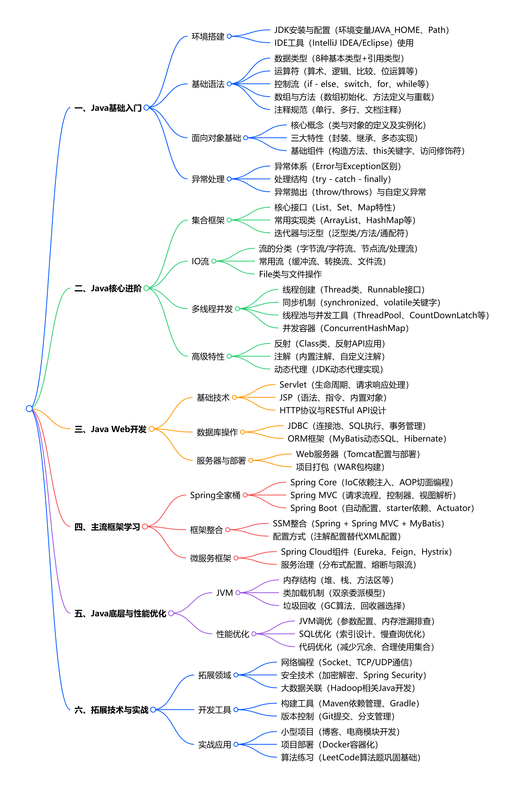

## **一、Java基础入门**
- 环境搭建
  - JDK安装与配置（环境变量JAVA_HOME、Path）
  - IDE工具（IntelliJ IDEA/Eclipse）使用
- 基础语法
  - 数据类型（8种基本类型+引用类型）
  - 运算符（算术、逻辑、比较、位运算等）
  - 控制流（if - else、switch、for、while等）
  - 数组与方法（数组初始化、方法定义与重载）
  - 注释规范（单行、多行、文档注释）
- 面向对象基础
  - 核心概念（类与对象的定义及实例化）
  - 三大特性（封装、继承、多态实现）
  - 基础组件（构造方法、this关键字、访问修饰符）
- 异常处理
  - 异常体系（Error与Exception区别）
  - 处理结构（try - catch - finally）
  - 异常抛出（throw/throws）与自定义异常
## **二、Java核心进阶**
- 集合框架
  - 核心接口（List、Set、Map特性）
  - 常用实现类（ArrayList、HashMap等）
  - 迭代器与泛型（泛型类/方法/通配符）
- IO流
  - 流的分类（字节流/字符流、节点流/处理流）
  - 常用流（缓冲流、转换流、文件流）
  - File类与文件操作
- 多线程并发
  - 线程创建（Thread类、Runnable接口）
  - 同步机制（synchronized、volatile关键字）
  - 线程池与并发工具（ThreadPool、CountDownLatch等）
  - 并发容器（ConcurrentHashMap）
- 高级特性
  - 反射（Class类、反射API应用）
  - 注解（内置注解、自定义注解）
  - 动态代理（JDK动态代理实现）
##  **三、Java Web开发**
- 基础技术
  - Servlet（生命周期、请求响应处理）
  - JSP（语法、指令、内置对象）
  - HTTP协议与RESTful API设计
- 数据库操作
  - JDBC（连接池、SQL执行、事务管理）
  - ORM框架（MyBatis动态SQL、Hibernate）
- 服务器与部署
  - Web服务器（Tomcat配置与部署）
  - 项目打包（WAR包构建）
##  **四、主流框架学习**
- Spring全家桶
  - Spring Core（IoC依赖注入、AOP切面编程）
  - Spring MVC（请求流程、控制器、视图解析）
  - Spring Boot（自动配置、starter依赖、Actuator）
- 框架整合
  - SSM整合（Spring + Spring MVC + MyBatis）
  - 配置方式（注解配置替代XML配置）
- 微服务框架
  - Spring Cloud组件（Eureka、Feign、Hystrix）
  - 服务治理（分布式配置、熔断与限流）
##  **五、Java底层与性能优化**
- JVM
  - 内存结构（堆、栈、方法区等）
  - 类加载机制（双亲委派模型）
  - 垃圾回收（GC算法、回收器选择）
- 性能优化
  - JVM调优（参数配置、内存泄漏排查）
  - SQL优化（索引设计、慢查询优化）
  - 代码优化（减少冗余、合理使用集合）
##  **六、拓展技术与实战**
- 拓展领域
  - 网络编程（Socket、TCP/UDP通信）
  - 安全技术（加密解密、Spring Security）
  - 大数据关联（Hadoop相关Java开发）
- 开发工具
  - 构建工具（Maven依赖管理、Gradle）
  - 版本控制（Git提交、分支管理）
- 实战应用
  - 小型项目（博客、电商模块开发）
  - 项目部署（Docker容器化）
  - 算法练习（LeetCode算法题巩固基础）

  