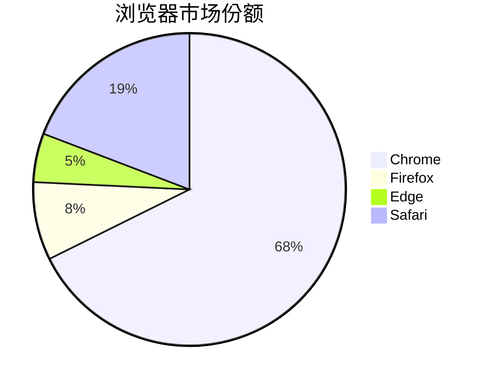
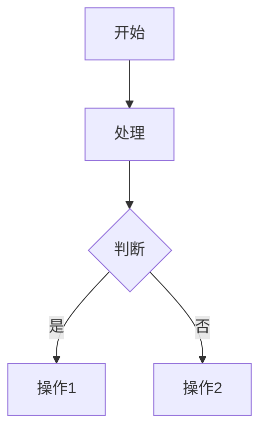
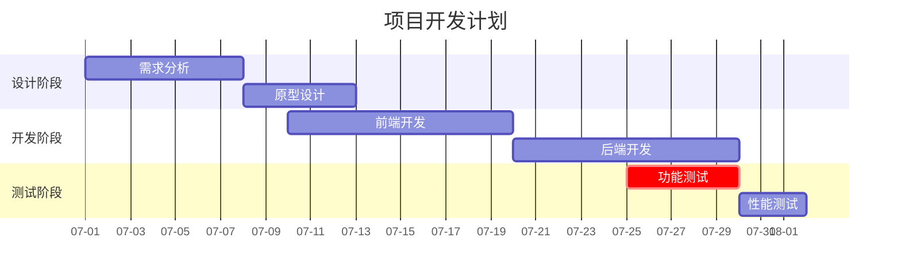
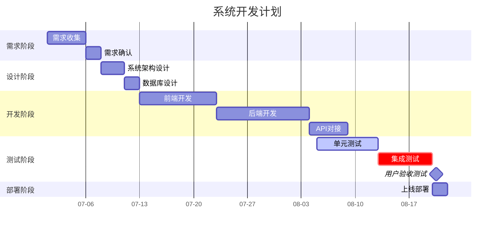

# markdown - 更简洁、更高效

markdown 不止是 HTML 的简化版，更重要的是 txt 的升级版、word 的轻量版、笔记的最佳载体。
掌握 markdown，享受简洁之美、享受效率提升。

[语法 😁 Steven Zhao](https://shd101wyy.github.io/markdown-preview-enhanced/#/zh-cn/)

---

[TOC]


## 1.标题语法

markdown 的标题是行首以#号开头，空格分割的，不同级别的标题，在 HX 里着色也不同。如下：

# 标题 1 {ignore=true}

## 标题 2 {ignore=true}

### 标题 3 {ignore=true}

#### 标题 4 {ignore=true}

##### 标题 5 {ignore=true}

###### 标题 6 {ignore=true}

## 2.列表

markdown 的列表支持有序列表、无序列表以及特殊的任务列表。
同样也是在行前加一个特殊符号，并空格后再跟列表文字内容。

### 2.1 有序列表

有序列表就是有顺序的列表，依靠行前的数字标记顺序。

1. 有序列表 1
2. 有序列表 2
3. 有序列表 3

### 2.2 无序列表

无序列表就是列表不排序，无序列表因书写随意而被更广泛的使用。
无序列表有 3 种前缀，HX 里分别用于表示 1 级列表、2 级列表、3 级列表。

- 无序列表 1
  - 1
  - 2
  - 3

* 无序列表 2
  - 1
  - 2
  - 3

- 无序列表 3
  - 1
  - 2
  - 3

### 2.3 任务列表

任务列表非常实用，管理待办、已办非常便利。

- [ ] 任务列表-未完成任务
- [x] 任务列表-已完成任务

### 2.4 引用列表

> 引用 1

## 3.文字样式语法

**加粗** 【快捷键：Ctrl+B】
_倾斜_
~~删除线~~
`单行代码`

[链接文字](https://www.baidu.com/)


<u>带下划线的文本</u>

$f(x) = sin(x) + cos(x) $

### 3.1 分割线

---

### 3.2 代码区

`已经支持高亮的语言`
C C++ Bash HTML CSS Go Haskell Java JavaScript Kotlin Lua Perl php Python Ruby Rust Swift TypeScript CoffeeScript Julia Pascal R VBScript SQL Scala SAS Dart Lisp D

`未支持高亮的语言`
C# ShellScript COBOL Ada AppleScript Delphi MatLab Objective-C VisualBasic Basic Objective-C++ jQuery

```javascript
var a = document;
```

### 3.3 注释

<!--注释-->

## 4.表格

|     |     |     |
| --- | --- | --- |
|     |     |     |
|     |     |     |

## 5.图表

### 饼状图



### 流程图



### 甘特图





`关键参数说明：`
title：图表标题。
dateFormat：日期格式（支持 YYYY-MM-DD、MM/DD/YYYY 等）。
axisFormat：坐标轴日期显示格式（%m-%d 表示月-日）。
section：分组标签（如“设计阶段”“开发阶段”）。

`任务定义：`
需求分析 :a1, 2025-07-01, 7d
a1：任务 ID（可选，用于依赖关系）。
2025-07-01：开始日期。
7d：持续时间（d=天，h=小时）。
active：当前正在进行的任务。
milestone：标记为菱形图标，表示无持续时间的节点。
crit：任务标记为红色（关键路径，通常影响项目总工期）。
after a1：表示任务在 a1 完成后开始。
and：连接多个依赖条件（如 after dev1 and dev2）。

### vega-lite 举例

```vega-lite
{
  "$schema": "https://vega.github.io/schema/vega-lite/v5.json",
  "data": {
    "values": [
      {"date": "2024-01", "sales": 100},
      {"date": "2024-02", "sales": 150},
      {"date": "2025-07", "sales": 200}
    ]
  },
  "mark": "line",
  "encoding": {
    "x": {"field": "date", "type": "temporal", "title": "月份"},
    "y": {"field": "sales", "type": "quantitative", "title": "销售额"},
    "color": {"value": "#4285F4"}
  }
}
```

## 6.支持 HTML
| 颜色代码 | 颜色名称 | 描述 |
|---------|---------|------|
| <table><tr><td bgcolor="#B32222"><font color="#000000" >深红</font></td></tr></table> | **#B32222 深红** | 位于光谱起始端，呈现暗红色调。 |
| <table><tr><td bgcolor="#D04A25"><font color="#000000" >红橙</font></td></tr></table> | **#D04A25 红橙** | 红色向橙色过渡的中间态，带有暖色调。 |
| <table><tr><td bgcolor="#E87421"><font color="#000000" >橙红</font></td></tr></table> | **#E87421 橙红** | 橙色与红色的混合色，亮度较高。 |
| <table><tr><td bgcolor="#FC9F4D"><font color="#000000" >亮橙</font></td></tr></table> | **#FC9F4D 亮橙** | 接近纯橙色，色彩饱和度强。 |
| <table><tr><td bgcolor="#FFB84D"><font color="#000000" >橙黄</font></td></tr></table> | **#FFB84D 橙黄** | 橙色向黄色过渡的中间色。 |
| <table><tr><td bgcolor="#FFD166"><font color="#000000" >浅黄</font></td></tr></table> | **#FFD166 浅黄** | 黄色调中带有白色成分，显得明亮。 |
| <table><tr><td bgcolor="#FFEF61"><font color="#000000" >明黄</font></td></tr></table> | **#FFEF61 明黄** | 接近纯黄色，色彩非常鲜亮。 |
| <table><tr><td bgcolor="#D4E157"><font color="#000000" >黄绿</font></td></tr></table> | **#D4E157 黄绿** | 黄色与绿色的混合色，带有自然感。 |
| <table><tr><td bgcolor="#8FBD8F"><font color="#000000" >浅绿</font></td></tr></table> | **#8FBD8F 浅绿** | 绿色调中带有灰色成分，显得柔和。 |
| <table><tr><td bgcolor="#4CAF50"><font color="#000000" >翠绿</font></td></tr></table> | **#4CAF50 翠绿** | 鲜艳的绿色，接近自然植被的颜色。 |
| <table><tr><td bgcolor="#008573"><font color="#000000" >青绿</font></td></tr></table> | **#008573 青绿** | 绿色向青色过渡的中间色。 |
| <table><tr><td bgcolor="#4DB6AC"><font color="#000000" >水绿</font></td></tr></table> | **#4DB6AC 水绿** | 带有蓝色成分的绿色，显得清澈。 |
| <table><tr><td bgcolor="#87CFEB"><font color="#000000" >天蓝</font></td></tr></table> | **#87CFEB 天蓝** | 接近天空的蓝色，色调明亮。 |
| <table><tr><td bgcolor="#4FC3F7"><font color="#000000" >浅蓝</font></td></tr></table> | **#4FC3F7 浅蓝** | 蓝色调中带有白色成分，显得轻盈。 |
| <table><tr><td bgcolor="#2196F3"><font color="#000000" >亮蓝</font></td></tr></table> | **#2196F3 亮蓝** | 鲜艳的蓝色，色彩饱和度高。 |
| <table><tr><td bgcolor="#3949AB"><font color="#000000" >靛蓝</font></td></tr></table> | **#3949AB 靛蓝** | 蓝色向紫色过渡的中间色，带有深邃感。 |
| <table><tr><td bgcolor="#7E57C2"><font color="#000000" >蓝紫</font></td></tr></table> | **#7E57C2 蓝紫** | 蓝色与紫色的混合色，显得神秘。 |
| <table><tr><td bgcolor="#9C64A6"><font color="#000000" >浅紫</font></td></tr></table> | **#9C64A6 浅紫** | 紫色调中带有灰色成分，显得优雅。 |
| <table><tr><td bgcolor="#CE93D8"><font color="#000000" >粉紫</font></td></tr></table> | **#CE93D8 粉紫** | 紫色与粉色的混合色，带有柔和感。 |
| <table><tr><td bgcolor="#B388FF"><font color="#000000" >薰衣草紫</font></td></tr></table> | **#B388FF 薰衣草紫** | 淡紫色调，接近薰衣草的颜色。 |

    #B32222 深红：位于光谱起始端，呈现暗红色调。
    #D04A25 红橙：红色向橙色过渡的中间态，带有暖色调。
    #E87421 橙红：橙色与红色的混合色，亮度较高。
    #FC9F4D 亮橙：接近纯橙色，色彩饱和度强。
    #FFB84D 橙黄：橙色向黄色过渡的中间色。
    #FFD166 浅黄：黄色调中带有白色成分，显得明亮。
    #FFEF61 明黄：接近纯黄色，色彩非常鲜亮。
    #D4E157 黄绿：黄色与绿色的混合色，带有自然感。
    #8FBD8F 浅绿：绿色调中带有灰色成分，显得柔和。
    #4CAF50 翠绿：鲜艳的绿色，接近自然植被的颜色。
    #008573 青绿：绿色向青色过渡的中间色。
    #4DB6AC 水绿：带有蓝色成分的绿色，显得清澈。
    #87CFEB 天蓝：接近天空的蓝色，色调明亮。
    #4FC3F7 浅蓝：蓝色调中带有白色成分，显得轻盈。
    #2196F3 亮蓝：鲜艳的蓝色，色彩饱和度高。
    #3949AB 靛蓝：蓝色向紫色过渡的中间色，带有深邃感。
    #7E57C2 蓝紫：蓝色与紫色的混合色，显得神秘。
    #9C64A6 浅紫：紫色调中带有灰色成分，显得优雅。
    #CE93D8 粉紫：紫色与粉色的混合色，带有柔和感。
    #B388FF 薰衣草紫：淡紫色调，接近薰衣草的颜色。
    #8F77B5 深紫：位于光谱末端，呈现暗紫色调。

 
| 颜色预览 | 颜色代码 & 名称 |
|----------|----------------|
| <div style="background-color: #8B0000; width: 60px; height: 20px; border: 1px solid #000;"></div> | `#8B0000` DarkRed (深红色) |
| <div style="background-color: #A52A2A; width: 60px; height: 20px; border: 1px solid #000;"></div> | `#A52A2A` Brown (棕色) |
| <div style="background-color: #B22222; width: 60px; height: 20px; border: 1px solid #000;"></div> | `#B22222` Firebrick (砖红色) |
| <div style="background-color: #CD5C5C; width: 60px; height: 20px; border: 1px solid #000;"></div> | `#CD5C5C` IndianRed (印度红) |
| <div style="background-color: #DC143C; width: 60px; height: 20px; border: 1px solid #000;"></div> | `#DC143C` Crimson (猩红色) |
| <div style="background-color: #FF69B4; width: 60px; height: 20px; border: 1px solid #000;"></div> | `#FF69B4` HotPink (亮粉色) |
| <div style="background-color: #FFC0CB; width: 60px; height: 20px; border: 1px solid #000;"></div> | `#FFC0CB` Pink (粉色) |
| <div style="background-color: #FFD1DC; width: 60px; height: 20px; border: 1px solid #000;"></div> | `#FFD1DC` LightPink (浅粉色) |
| <div style="background-color: #FF7F50; width: 60px; height: 20px; border: 1px solid #000;"></div> | `#FF7F50` Coral (珊瑚色) |
| <div style="background-color: #FF4500; width: 60px; height: 20px; border: 1px solid #000;"></div> | `#FF4500` OrangeRed (橙红色) |
| <div style="background-color: #FFA500; width: 60px; height: 20px; border: 1px solid #000;"></div> | `#FFA500` Orange (橙色) |
| <div style="background-color: #FFBF00; width: 60px; height: 20px; border: 1px solid #000;"></div> | `#FFBF00` Amber (琥珀色) |
| <div style="background-color: #FFD700; width: 60px; height: 20px; border: 1px solid #000;"></div> | `#FFD700` Gold (金色) |
| <div style="background-color: #FFFACD; width: 60px; height: 20px; border: 1px solid #000;"></div> | `#FFFACD` LemonChiffon (柠檬绸) |
| <div style="background-color: #FFF44F; width: 60px; height: 20px; border: 1px solid #000;"></div> | `#FFF44F` LightYellow (浅黄色) |
| <div style="background-color: #FFFF00; width: 60px; height: 20px; border: 1px solid #000;"></div> | `#FFFF00` Yellow (黄色) |
| <div style="background-color: #808000; width: 60px; height: 20px; border: 1px solid #000;"></div> | `#808000` Olive (橄榄色) |
| <div style="background-color: #ADFF2F; width: 60px; height: 20px; border: 1px solid #000;"></div> | `#ADFF2F` GreenYellow (黄绿色) |
| <div style="background-color: #7CFC00; width: 60px; height: 20px; border: 1px solid #000;"></div> | `#7CFC00` LawnGreen (草坪绿) |
| <div style="background-color: #32CD32; width: 60px; height: 20px; border: 1px solid #000;"></div> | `#32CD32` LimeGreen (酸橙绿) |
| <div style="background-color: #90EE90; width: 60px; height: 20px; border: 1px solid #000;"></div> | `#90EE90` LightGreen (浅绿色) |
| <div style="background-color: #98FB98; width: 60px; height: 20px; border: 1px solid #000;"></div> | `#98FB98` PaleGreen (苍白的绿色) |
| <div style="background-color: #87CEFA; width: 60px; height: 20px; border: 1px solid #000;"></div> | `#87CEFA` LightSkyBlue (浅天蓝色) |
| <div style="background-color: #1E90FF; width: 60px; height: 20px; border: 1px solid #000;"></div> | `#1E90FF` DodgerBlue (道奇蓝) |
| <div style="background-color: #0000FF; width: 60px; height: 20px; border: 1px solid #000;"></div> | `#0000FF` Blue (蓝色) |
| <div style="background-color: #4B0082; width: 60px; height: 20px; border: 1px solid #000;"></div> | `#4B0082` Indigo (靛青色) |
| <div style="background-color: #8A2BE2; width: 60px; height: 20px; border: 1px solid #000;"></div> | `#8A2BE2` BlueViolet (蓝紫色) |
| <div style="background-color: #9370DB; width: 60px; height: 20px; border: 1px solid #000;"></div> | `#9370DB` MediumPurple (中紫色) |
| <div style="background-color: #DDA0DD; width: 60px; height: 20px; border: 1px solid #000;"></div> | `#DDA0DD` Plum (李子色) |
| <div style="background-color: #DA70D6; width: 60px; height: 20px; border: 1px solid #000;"></div> | `#DA70D6` Orchid (兰花紫) |
| <div style="background-color: #E6E6FA; width: 60px; height: 20px; border: 1px solid #000;"></div> | `#E6E6FA` Lavender (薰衣草) |
| <div style="background-color: #483D8B; width: 60px; height: 20px; border: 1px solid #000;"></div> | `#483D8B` DarkSlateBlue (暗岩蓝) |
| <div style="background-color: #FF00FF; width: 60px; height: 20px; border: 1px solid #000;"></div> | `#FF00FF` Fuchsia (紫红色) |
| <div style="background-color: #8B008B; width: 60px; height: 20px; border: 1px solid #000;"></div> | `#8B008B` DarkMagenta (暗洋红) |

   #8B0000, #A52A2A, #B22222, #CD5C5C, #DC143C, 
    #FF69B4, #FFC0CB, #FFD1DC, #FF7F50, #FF4500, 
    #FFA500, #FFBF00, #FFD700, #FFFACD, #FFF44F, 
    #FFFF00, #808000, #ADFF2F, #7CFC00, #32CD32, 
    #90EE90, #98FB98, #87CEFA, #1E90FF, #0000FF, 
    #4B0082, #8A2BE2, #9370DB, #DDA0DD, #DA70D6, 
    #E6E6FA, #483D8B, #FF00FF, #8B008B