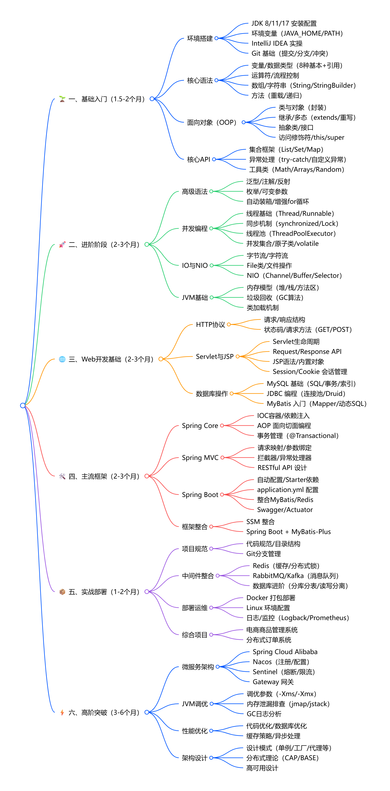
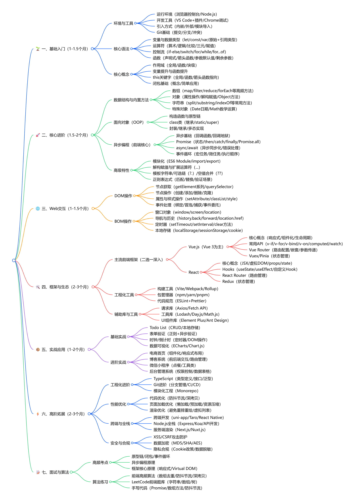
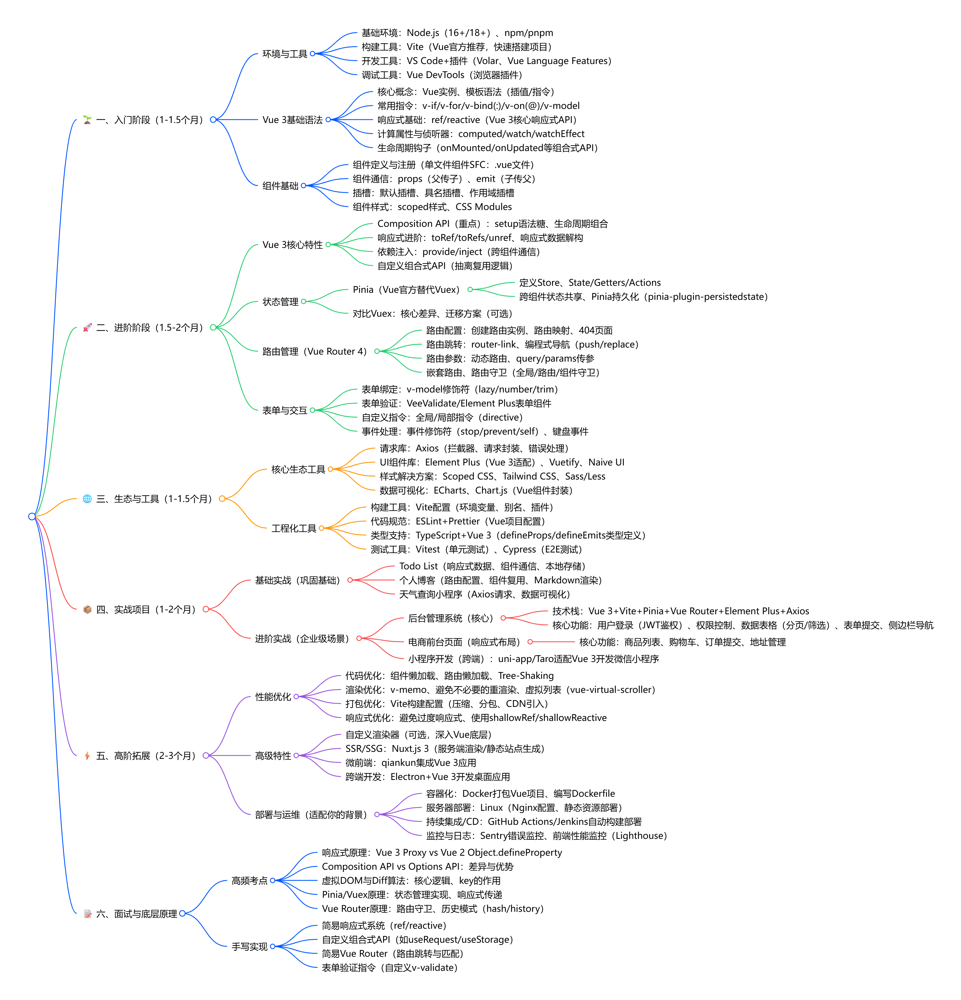
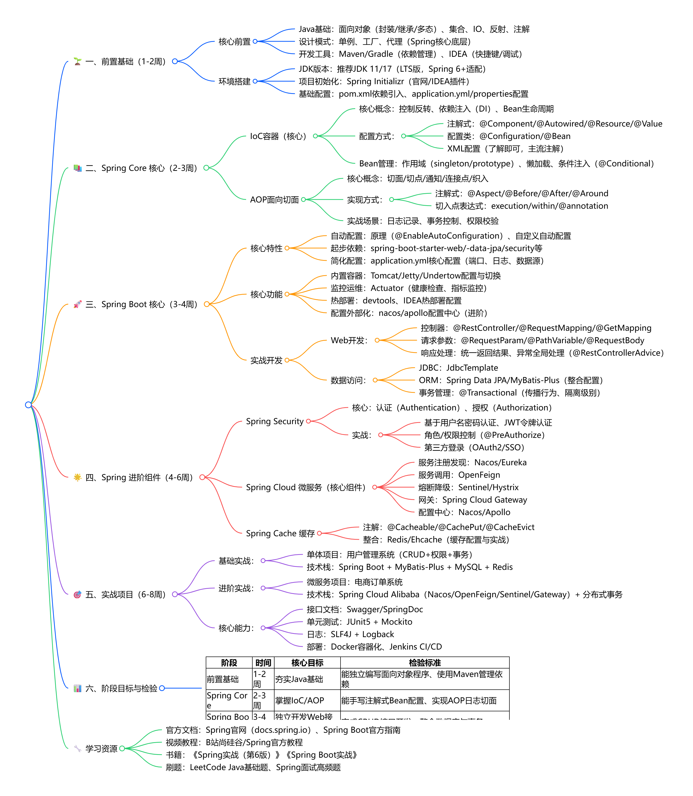

[TOC]

# 1️⃣Java学习路线
## 🌱 一、基础入门（1.5-2个月）
- 环境搭建
  - JDK 8/11/17 安装配置
  - 环境变量（JAVA_HOME/PATH）
  - IntelliJ IDEA 实操
  - Git 基础（提交/分支/冲突）
- 核心语法
  - 变量/数据类型（8种基本+引用）
  - 运算符/流程控制
  - 数组/字符串（String/StringBuilder）
  - 方法（重载/递归）
- 面向对象（OOP）
  - 类与对象（封装）
  - 继承/多态（extends/重写）
  - 抽象类/接口
  - 访问修饰符/this/super
- 核心API
  - 集合框架（List/Set/Map）
  - 异常处理（try-catch/自定义异常）
  - 工具类（Math/Arrays/Random）
## 🚀 二、进阶阶段（2-3个月）
- 高级语法
  - 泛型/注解/反射
  - 枚举/可变参数
  - 自动装箱/增强for循环
- 并发编程
  - 线程基础（Thread/Runnable）
  - 同步机制（synchronized/Lock）
  - 线程池（ThreadPoolExecutor）
  - 并发集合/原子类/volatile
- IO与NIO
  - 字节流/字符流
  - File类/文件操作
  - NIO（Channel/Buffer/Selector）
- JVM基础
  - 内存模型（堆/栈/方法区）
  - 垃圾回收（GC算法）
  - 类加载机制
## 🌐 三、Web开发基础（2-3个月）
- HTTP协议
  - 请求/响应结构
  - 状态码/请求方法（GET/POST）
- Servlet与JSP
  - Servlet生命周期
  - Request/Response API
  - JSP语法/内置对象
  - Session/Cookie 会话管理
- 数据库操作
  - MySQL 基础（SQL/事务/索引）
  - JDBC 编程（连接池/Druid）
  - MyBatis 入门（Mapper/动态SQL）
## 🛠️ 四、主流框架（2-3个月）
- Spring Core
  - IOC容器/依赖注入
  - AOP 面向切面编程
  - 事务管理（@Transactional）
- Spring MVC
  - 请求映射/参数绑定
  - 拦截器/异常处理器
  - RESTful API 设计
- Spring Boot
  - 自动配置/Starter依赖
  - application.yml 配置
  - 整合MyBatis/Redis
  - Swagger/Actuator
- 框架整合
  - SSM 整合
  - Spring Boot + MyBatis-Plus
## 📦 五、实战部署（1-2个月）
- 项目规范
  - 代码规范/目录结构
  - Git分支管理
- 中间件整合
  - Redis（缓存/分布式锁）
  - RabbitMQ/Kafka（消息队列）
  - 数据库进阶（分库分表/读写分离）
- 部署运维
  - Docker 打包部署
  - Linux 环境配置
  - 日志/监控（Logback/Prometheus）
- 综合项目
  - 电商商品管理系统
  - 分布式订单系统
## ⚡ 六、高阶突破（3-6个月）
- 微服务架构
  - Spring Cloud Alibaba
  - Nacos（注册/配置）
  - Sentinel（熔断/限流）
  - Gateway 网关
- JVM调优
  - 调优参数（-Xms/-Xmx）
  - 内存泄漏排查（jmap/jstack）
  - GC日志分析
- 性能优化
  - 代码优化/数据库优化
  - 缓存策略/异步处理
- 架构设计
  - 设计模式（单例/工厂/代理等）
  - 分布式理论（CAP/BASE）
  - 高可用设计

# 2️⃣JavaScript学习路线
## 🌱 一、基础入门（1-1.5个月）
- 环境与工具
  - 运行环境（浏览器控制台/Node.js）
  - 开发工具（VS Code+插件/Chrome调试）
  - 引入方式（内嵌/外部/模块导入）
  - Git基础（提交/分支/冲突）
- 核心语法
  - 变量与数据类型（let/const/var/原始+引用类型）
  - 运算符（算术/逻辑/比较/三元/赋值）
  - 控制流（if-else/switch/for/while/for...of）
  - 函数（声明式/箭头函数/参数默认值/剩余参数）
- 核心概念
  - 作用域（全局/函数/块级）
  - 变量提升与函数提升
  - this关键字（全局/函数/箭头函数指向）
  - 闭包基础（概念/简单应用）
## 🚀 二、核心进阶（1.5-2个月）
- 数据结构与内置方法
  - 数组（map/filter/reduce/forEach等高频方法）
  - 对象（属性操作/解构赋值/Object方法）
  - 字符串（split/substring/indexOf等常用方法）
  - 特殊对象（Date日期/Math数学运算）
- 面向对象（OOP）
  - 构造函数与原型链
  - class类（继承/static/super）
  - 封装/继承/多态实现
- 异步编程（前端核心）
  - 异步基础（回调函数/回调地狱）
  - Promise（状态/then/catch/finally/Promise.all）
  - async/await（异步同步化/错误处理）
  - 事件循环（宏任务/微任务/执行顺序）
- 高级特性
  - 模块化（ES6 Module/import/export）
  - 解构赋值与扩展运算符（...）
  - 模板字符串/可选链（?.）/空值合并（??）
  - 正则表达式（匹配/替换/验证场景）
## 🌐 三、Web交互（1-1.5个月）
- DOM操作
  - 节点获取（getElement系列/querySelector）
  - 节点操作（创建/添加/删除/克隆）
  - 属性与样式操作（setAttribute/classList/style）
  - 事件处理（绑定/冒泡/捕获/事件委托）
- BOM操作
  - 窗口对象（window/screen/location）
  - 导航与历史（history.back/forward/location.href）
  - 定时器（setTimeout/setInterval/clear方法）
  - 本地存储（localStorage/sessionStorage/cookie）
## 🛠️ 四、框架与生态（2-3个月）
- 主流前端框架（二选一深入）
  - Vue.js（Vue 3为主）
    - 核心概念（响应式/组件化/生命周期）
    - 常用API（v-if/v-for/v-bind/v-on/computed/watch）
    - Vue Router（路由配置/嵌套/参数传递）
    - Vuex/Pinia（状态管理）
  - React
    - 核心概念（JSX/虚拟DOM/props/state）
    - Hooks（useState/useEffect/自定义Hook）
    - React Router（路由管理）
    - Redux（状态管理）
- 工程化工具
  - 构建工具（Vite/Webpack/Rollup）
  - 包管理器（npm/yarn/pnpm）
  - 代码规范（ESLint+Prettier）
- 辅助库与工具
  - 请求库（Axios/Fetch API）
  - 工具库（Lodash/Day.js/Math.js）
  - UI组件库（Element Plus/Ant Design）
## 📦 五、实战应用（1-2个月）
- 基础实战
  - Todo List（CRUD/本地存储）
  - 表单验证（正则+异步验证）
  - 时钟/倒计时（定时器/DOM操作）
  - 数据可视化（ECharts/Chart.js）
- 进阶实战
  - 电商首页（组件化/响应式布局）
  - 博客系统（前后端交互/路由管理）
  - 微信小程序（点餐/工具类）
  - 后台管理系统（权限控制/数据表格）
## ⚡ 六、高阶拓展（2-3个月）
- 工程化进阶
  - TypeScript（类型定义/接口/泛型）
  - Git进阶（分支管理/CI/CD）
  - 模块化工程（Monorepo）
- 性能优化
  - 代码优化（防抖节流/深拷贝）
  - 页面加载优化（懒加载/预加载/资源压缩）
  - 渲染优化（避免重排重绘/虚拟列表）
- 跨端与全栈
  - 跨端开发（uni-app/Taro/React Native）
  - Node.js全栈（Express/Koa/API开发）
  - 服务端渲染（Next.js/Nuxt.js）
- 安全与合规
  - XSS/CSRF攻击防护
  - 数据加密（MD5/SHA/AES）
  - 隐私合规（Cookie政策/数据脱敏）
## 📝 七、面试与算法
- 高频考点
  - 原型链/闭包/事件循环
  - 异步编程原理
  - 框架核心原理（响应式/Virtual DOM）
- 算法练习
  - 前端高频算法（数组去重/防抖节流/深拷贝）
  - LeetCode前端题库（字符串/数组/树）
  - 手写代码（Promise/数组方法/防抖节流）
  

# 3️⃣Python学习路线
## 🌱 一、基础入门（1-1.5个月）
- 环境与工具
  - Python 3.9+/3.10（推荐版本）安装
  - 开发工具（PyCharm/VS Code+插件）
  - 虚拟环境（venv/conda）配置
  - Git基础（提交/分支/冲突解决）
- 核心语法
  - 变量与数据类型（int/str/list/dict/tuple/set）
  - 运算符（算术/逻辑/比较/赋值/三元运算符）
  - 控制流（if-else/for/while/break/continue）
  - 函数（定义/参数/返回值/匿名函数lambda）
- 基础数据结构
  - 列表（list）：增删改查、切片、常用方法
  - 字典（dict）：键值对操作、遍历、get/items方法
  - 字符串（str）：拼接/分割/替换/正则基础
  - 元组（tuple）/集合（set）：特性与使用场景
- 核心概念
  - 缩进规范（Python特色）
  - 变量作用域（全局/局部/闭包）
  - 异常处理（try-except-finally/自定义异常）
  - 输入输出（input()/print()/文件读写基础）
## 🚀 二、进阶阶段（1.5-2个月）
- 面向对象（OOP）
  - 类与对象（class/实例化）
  - 封装/继承/多态（__init__/super/重写）
  - 类属性/实例属性、类方法/静态方法
  - 魔术方法（__str__/__repr__/__call__）
- 模块与包
  - 内置模块（os/sys/time/datetime/json）
  - 第三方包安装与使用（pip命令）
  - 自定义模块与包（__init__.py）
  - 模块导入（import/from...import/别名）
- 高级语法
  - 列表推导式/字典推导式/生成器（yield）
  - 装饰器（@decorator）基础与应用
  - 迭代器与可迭代对象
  - 上下文管理器（with语句）
- 文件与IO
  - 文本文件（read/write/append）
  - 二进制文件操作
  - CSV/JSON文件读写
  - 路径处理（pathlib/os.path）
## 🌐 三、应用方向分支（2-3个月，选1-2个深耕）
- 数据分析/数据可视化
  - 核心库：Pandas（数据清洗/筛选/聚合）
  - 可视化：Matplotlib（基础图表）、Seaborn（美化）、Plotly（交互式）
  - 辅助工具：NumPy（数组运算）、SciPy（科学计算）
  - 实战场景：Excel数据处理、报表生成、数据洞察
- 后端开发
  - Web框架：FastAPI（高性能）、Django（全栈）、Flask（轻量）
  - 数据库：SQLAlchemy（ORM）、MySQL/PostgreSQL连接
  - 接口开发：RESTful API、Swagger文档、请求验证
  - 部署：Uvicorn（ASGI服务器）、Docker打包
- 网络爬虫
  - 基础库：requests（HTTP请求）、BeautifulSoup4（解析HTML）
  - 进阶工具：Scrapy（爬虫框架）、Selenium（动态页面）
  - 数据存储：MongoDB（非结构化）、CSV/Excel
  - 反爬应对：代理IP、User-Agent池、验证码识别
- AI/机器学习
  - 基础库：NumPy（数组）、Pandas（数据处理）
  - 机器学习：Scikit-learn（分类/回归/聚类）
  - 深度学习：TensorFlow/PyTorch（模型搭建）
  - 辅助工具：Jupyter Notebook（实验环境）
- 自动化运维/办公
  - 自动化办公：openpyxl（Excel）、python-docx（Word）、pdfplumber（PDF）
  - 运维脚本：Paramiko（SSH）、Fabric（批量操作）、logging（日志）
  - 接口自动化：requests+unittest/pytest
  - 爬虫自动化：定时任务（APScheduler）
## 📦 四、实战项目（1-2个月）
- 基础实战（巩固基础）
  - 学生信息管理系统（控制台版）
  - 简易计算器（GUI/命令行）
  - 文本处理工具（批量替换/统计词频）
  - 天气查询小程序（调用公开API）
- 进阶实战（方向适配）
  - 数据分析：电商销售数据可视化报表
  - 后端：个人博客系统（FastAPI+MySQL）
  - 爬虫：知乎话题问答爬取与分析
  - 自动化：Excel批量数据录入+邮件发送
  - AI：手写数字识别（Scikit-learn/PyTorch）
## ⚡ 五、高阶拓展（2-3个月）
- 性能优化
  - 代码优化（减少循环、使用推导式）
  - 多线程/多进程（threading/multiprocessing）
  - 异步编程（asyncio/httpx异步版）
  - 内存优化（避免内存泄漏、生成器替代列表）
- 设计模式与架构
  - 常用设计模式（单例/工厂/代理/观察者）
  - 模块化编程（解耦/复用）
  - 分布式编程（Celery任务队列）
- 云原生与部署
  - 云平台：AWS/Azure/阿里云SDK使用
  - 容器化：Docker+Docker Compose
  - 持续集成/CD（GitHub Actions/Jenkins）
  - 服务器部署：Linux（CentOS/Ubuntu）实操
- 安全与合规
  - 数据加密（hashlib/AES）
  - 接口鉴权（JWT/OAuth2.0）
  - 爬虫合规（robots.txt、反爬边界）
  - 代码安全（避免SQL注入、XSS）
## 📝 六、面试与提升
- 高频考点
  - 基础：深浅拷贝、闭包、装饰器、生成器
  - 进阶：GIL锁、垃圾回收机制、协程
  - 框架：FastAPI/Django核心原理、ORM机制
- 算法练习
  - LeetCode Python题库（数组/字符串/树/动态规划）
  - 前端高频算法（排序/查找/去重）
  - 手写代码：装饰器、深拷贝、LRU缓存
  

# 4️⃣Vue3学习路线
## 🌱 一、入门阶段（1-1.5个月）
- 环境与工具
  - 基础环境：Node.js（16+/18+）、npm/pnpm
  - 构建工具：Vite（Vue官方推荐，快速搭建项目）
  - 开发工具：VS Code+插件（Volar、Vue Language Features）
  - 调试工具：Vue DevTools（浏览器插件）
- Vue 3基础语法
  - 核心概念：Vue实例、模板语法（插值/指令）
  - 常用指令：v-if/v-for/v-bind(:)/v-on(@)/v-model
  - 响应式基础：ref/reactive（Vue 3核心响应式API）
  - 计算属性与侦听器：computed/watch/watchEffect
  - 生命周期钩子（onMounted/onUpdated等组合式API）
- 组件基础
  - 组件定义与注册（单文件组件SFC：.vue文件）
  - 组件通信：props（父传子）、emit（子传父）
  - 插槽：默认插槽、具名插槽、作用域插槽
  - 组件样式：scoped样式、CSS Modules
## 🚀 二、进阶阶段（1.5-2个月）
- Vue 3核心特性
  - Composition API（重点）：setup语法糖、生命周期组合
  - 响应式进阶：toRef/toRefs/unref、响应式数据解构
  - 依赖注入：provide/inject（跨组件通信）
  - 自定义组合式API（抽离复用逻辑）
- 状态管理
  - Pinia（Vue官方替代Vuex）
    - 定义Store、State/Getters/Actions
    - 跨组件状态共享、Pinia持久化（pinia-plugin-persistedstate）
  - 对比Vuex：核心差异、迁移方案（可选）
- 路由管理（Vue Router 4）
  - 路由配置：创建路由实例、路由映射、404页面
  - 路由跳转：router-link、编程式导航（push/replace）
  - 路由参数：动态路由、query/params传参
  - 嵌套路由、路由守卫（全局/路由/组件守卫）
- 表单与交互
  - 表单绑定：v-model修饰符（lazy/number/trim）
  - 表单验证：VeeValidate/Element Plus表单组件
  - 自定义指令：全局/局部指令（directive）
  - 事件处理：事件修饰符（stop/prevent/self）、键盘事件
## 🌐 三、生态与工具（1-1.5个月）
- 核心生态工具
  - 请求库：Axios（拦截器、请求封装、错误处理）
  - UI组件库：Element Plus（Vue 3适配）、Vuetify、Naive UI
  - 样式解决方案：Scoped CSS、Tailwind CSS、Sass/Less
  - 数据可视化：ECharts、Chart.js（Vue组件封装）
- 工程化工具
  - 构建工具：Vite配置（环境变量、别名、插件）
  - 代码规范：ESLint+Prettier（Vue项目配置）
  - 类型支持：TypeScript+Vue 3（defineProps/defineEmits类型定义）
  - 测试工具：Vitest（单元测试）、Cypress（E2E测试）
## 📦 四、实战项目（1-2个月）
- 基础实战（巩固基础）
  - Todo List（响应式数据、组件通信、本地存储）
  - 个人博客（路由配置、组件复用、Markdown渲染）
  - 天气查询小程序（Axios请求、数据可视化）
- 进阶实战（企业级场景）
  - 后台管理系统（核心）
    - 技术栈：Vue 3+Vite+Pinia+Vue Router+Element Plus+Axios
    - 核心功能：用户登录（JWT鉴权）、权限控制、数据表格（分页/筛选）、表单提交、侧边栏导航
  - 电商前台页面（响应式布局）
    - 核心功能：商品列表、购物车、订单提交、地址管理
  - 小程序开发（跨端）：uni-app/Taro适配Vue 3开发微信小程序
## ⚡ 五、高阶拓展（2-3个月）
- 性能优化
  - 代码优化：组件懒加载、路由懒加载、Tree-Shaking
  - 渲染优化：v-memo、避免不必要的重渲染、虚拟列表（vue-virtual-scroller）
  - 打包优化：Vite构建配置（压缩、分包、CDN引入）
  - 响应式优化：避免过度响应式、使用shallowRef/shallowReactive
- 高级特性
  - 自定义渲染器（可选，深入Vue底层）
  - SSR/SSG：Nuxt.js 3（服务端渲染/静态站点生成）
  - 微前端：qiankun集成Vue 3应用
  - 跨端开发：Electron+Vue 3开发桌面应用
- 部署与运维（适配你的背景）
  - 容器化：Docker打包Vue项目、编写Dockerfile
  - 服务器部署：Linux（Nginx配置、静态资源部署）
  - 持续集成/CD：GitHub Actions/Jenkins自动构建部署
  - 监控与日志：Sentry错误监控、前端性能监控（Lighthouse）
## 📝 六、面试与底层原理
- 高频考点
  - 响应式原理：Vue 3 Proxy vs Vue 2 Object.defineProperty
  - Composition API vs Options API：差异与优势
  - 虚拟DOM与Diff算法：核心逻辑、key的作用
  - Pinia/Vuex原理：状态管理实现、响应式传递
  - Vue Router原理：路由守卫、历史模式（hash/history）
- 手写实现
  - 简易响应式系统（ref/reactive）
  - 自定义组合式API（如useRequest/useStorage）
  - 简易Vue Router（路由跳转与匹配）
  - 表单验证指令（自定义v-validate）
  

# 5️⃣SpringBoot学习路线
## 🌱 一、入门阶段（1-1.5个月）
- 环境与工具
  - 基础环境：JDK 8/17、Maven/Gradle、Git
  - 开发工具：IntelliJ IDEA（Spring Boot插件）、Mac终端（Homebrew配置依赖）
  - 项目搭建：Spring Initializr（官网/IDEA插件）、Vite（前端联动）
  - 调试工具：IDEA断点调试、Spring Boot DevTools（热部署）
- 核心基础
  - 核心特性：自动配置（@SpringBootApplication）、Starter依赖（场景化引入）
  - 配置体系：application.yml/properties（全局配置）、多环境配置（dev/test/prod）
  - 核心注解：@Controller/@Service/@Repository/@Component、@Autowired/@Resource
  - 基础开发：Controller（请求映射）、Service（业务逻辑）、Mapper（数据访问）分层
  - 接口开发：RESTful API设计（GET/POST/PUT/DELETE）、JSON返回（@ResponseBody）
- 实操任务
  - 快速搭建「Hello World」项目（验证环境）
  - 开发「用户列表查询」接口（GET请求+JSON响应）
  - 实现多环境配置切换（dev环境连接本地数据库，test环境用测试库）
## 🚀 二、进阶阶段（1.5-2个月）
- 数据访问
  - 数据库整合：MySQL/PostgreSQL、连接池（HikariCP默认）
  - ORM框架：MyBatis（Mapper映射、动态SQL）、MyBatis-Plus（CRUD封装、分页）
  - 事务管理：@Transactional（声明式事务）、事务隔离级别、异常回滚
  - 其他数据库：Redis（缓存）、MongoDB（非结构化数据）、Sharding-JDBC（分库分表）
- Spring Boot核心原理
  - 自动配置原理：@EnableAutoConfiguration、SPI机制（META-INF/spring.factories）
  - Starter自定义：实现专属Starter（场景化依赖封装）
  - Bean生命周期：@ComponentScan扫描规则、@Bean定义与注入
  - 配置绑定：@ConfigurationProperties（配置文件映射实体）
- Web进阶
  - 请求处理：@RequestParam/@PathVariable/@RequestBody（参数绑定）
  - 拦截器：HandlerInterceptor（登录验证、日志记录）
  - 异常处理：@RestControllerAdvice（全局异常捕获）、自定义异常
  - 过滤器：Filter（请求过滤、编码处理）
- 实操任务
  - 开发「用户管理系统」：实现用户CRUD（MyBatis-Plus+MySQL）
  - 添加事务控制：模拟「下单减库存」（保证数据一致性）
  - 实现全局异常处理：统一返回格式（code/message/data）
## 🌐 三、生态整合阶段（1.5-2个月）
- 核心生态工具
  - 安全框架：Spring Security（认证授权）、JWT（无状态登录）
  - 接口文档：Swagger/Knife4j（自动生成API文档）
  - 缓存：Redis（Spring Cache注解：@Cacheable/@CacheEvict）
  - 消息队列：RabbitMQ/Kafka（异步通信、削峰填谷）
  - 定时任务：@Scheduled（静态定时）、Quartz（动态定时）
- 运维相关整合
  - 监控：Spring Boot Actuator（健康检查、指标暴露）
  - 日志：Logback/Log4j2（日志配置、滚动日志、ELK集成）
  - 配置中心：Nacos（分布式配置管理，适配微服务）
- 实操任务
  - 整合Spring Security+JWT：实现用户登录认证、接口权限控制
  - 集成Redis：缓存热点数据（如商品列表）、Session共享
  - 配置Actuator+Prometheus：监控JVM内存、接口响应时间
## 📦 四、实战项目阶段（1-2个月）
- 基础实战（巩固核心）
  - 博客系统：用户登录、文章CRUD、分类标签、评论功能
  - 接口测试：Postman/JUnit5（接口自动化测试）
- 企业级实战（综合应用）
  - 电商订单系统（核心推荐）
    - 技术栈：Spring Boot+MyBatis-Plus+Redis+RabbitMQ+JWT+Actuator
    - 核心功能：用户认证、商品查询（缓存）、下单（事务+消息队列）、订单查询、权限控制
    - 运维亮点：Docker打包、Nginx反向代理、日志收集
- 部署实操（适配运维背景）
  - 本地部署：Jar包运行（java -jar）、配置文件外部挂载
  - Docker部署：编写Dockerfile、Docker Compose编排（多服务联动）
  - Linux部署：CentOS/Ubuntu环境配置、防火墙开放、进程守护（systemd）
## ⚡ 五、高阶拓展阶段（2-3个月）
- 微服务整合（Spring Cloud Alibaba）
  - 服务注册与发现：Nacos
  - 服务调用：OpenFeign（声明式HTTP客户端）
  - 熔断限流：Sentinel（服务保护）
  - 网关：Spring Cloud Gateway（路由转发、权限校验）
- 性能优化
  - JVM调优：堆内存配置（-Xms/-Xmx）、GC算法选择（G1/ZGC）
  - 代码优化：避免冗余、合理使用设计模式（单例/工厂/代理）
  - 数据库优化：索引设计、慢查询优化（explain分析）、读写分离
  - 接口优化：异步处理（@Async）、缓存策略（本地缓存+Caffeine+Redis）
- 云原生与运维进阶
  - 容器化：Docker+Kubernetes（K8s）部署Spring Boot应用
  - 持续集成/CD：Jenkins/GitHub Actions（自动构建、测试、部署）
  - 故障排查：JVM问题（jmap/jstack/jhat）、接口超时排查（SkyWalking链路追踪）
- 实操任务
  - 微服务改造：将订单系统拆分为用户服务、商品服务、订单服务
  - K8s部署：编写Deployment.yaml、Service.yaml，实现服务暴露
  - 性能调优：优化订单接口响应时间（从500ms降至100ms内）
## 📝 六、面试与底层原理
- 高频考点
  - 核心原理：自动配置机制、Starter工作原理、Bean加载流程
  - 事务：声明式事务实现原理、事务传播机制
  - 缓存：Spring Cache工作原理、Redis缓存穿透/击穿/雪崩解决方案
  - 运维相关：Actuator监控指标、日志配置最佳实践、Docker部署流程
- 手写实现
  - 自定义Starter（如自定义日志Starter）
  - 简易自动配置类（模拟@EnableAutoConfiguration）
  - 自定义缓存注解（类似@Cacheable）
  

# 6️⃣Git学习路线
## 🌱 一、入门阶段（1-2周）
- 环境与工具
  - 安装配置（Mac）：Homebrew安装（`brew install git`）、官网下载
  - 基础配置：用户名/邮箱设置（`git config --global`）、SSH密钥生成（适配GitHub/GitLab）
  - 开发工具：终端命令行、VS Code Git插件、SourceTree（图形化工具，可选）
  - 仓库准备：本地仓库初始化、远程仓库（GitHub/GitLab/Gitee）创建
- 核心概念
  - 版本控制基础：工作区、暂存区（index）、本地仓库、远程仓库
  - 核心流程：修改→暂存→提交→推送（workspace→index→local repo→remote repo）
  - 常用术语：commit（提交）、branch（分支）、merge（合并）、pull/push（拉取/推送）
- 基础操作
  - 本地仓库操作：`git init`（初始化）、`git add`（暂存）、`git commit -m`（提交）
  - 状态查看：`git status`（文件状态）、`git log`（提交日志）
  - 远程仓库关联：`git remote add origin`（关联远程）、`git clone`（克隆远程仓库）
  - 简单回滚：`git reset --hard 提交ID`（本地回滚）、`git checkout -- 文件名`（撤销工作区修改）
- 实操任务
  - 初始化本地仓库，提交1个文件（如README.md），推送到GitHub远程仓库
  - 修改文件后，通过`git add`→`git commit`→`git push`完成版本更新
  - 用`git log`查看提交历史，用`git reset`回滚到上一版本

## 🚀 二、进阶阶段（2-3周）
- 分支管理（核心）
  - 分支基础：`git branch`（创建/查看分支）、`git checkout`（切换分支）、`git switch`（Vue 3推荐切换命令）
  - 分支合并：`git merge`（合并分支）、`git merge --abort`（取消合并）
  - 分支删除：`git branch -d`（本地删除）、`git push origin --delete`（远程删除）
  - 常用分支策略：master（主分支）、dev（开发分支）、feature（功能分支）、hotfix（紧急修复分支）
- 协作操作
  - 拉取远程更新：`git pull`（= `git fetch` + `git merge`）、`git fetch`（获取远程分支，不合并）
  - 解决冲突：冲突场景识别、手动编辑冲突文件、`git add`→`git commit`完成冲突提交
  - 标签管理：`git tag`（创建标签）、`git push origin 标签名`（推送标签）、`git checkout 标签名`（切换到标签版本）
  -  stash暂存：`git stash`（暂存未提交修改）、`git stash pop`（恢复暂存）、`git stash clear`（清空暂存）
- 进阶操作
  - 历史修改：`git rebase`（变基，整理提交历史）、`git commit --amend`（修改最近一次提交）
  - 日志筛选：`git log --oneline`（简洁日志）、`git log --graph`（图形化日志）、`git log -p`（查看提交内容差异）
  - 远程仓库操作：`git remote -v`（查看远程关联）、`git remote set-url`（修改远程地址）、`git fetch origin`（获取远程所有分支）
- 实操任务
  - 基于dev分支创建feature分支，开发完成后合并回dev分支，解决合并冲突
  - 用`git rebase`整理feature分支的提交历史，再合并到dev分支
  - 给稳定版本打标签（如v1.0.0），推送标签到远程仓库
  - 用`git stash`暂存当前工作，切换到hotfix分支修复bug后，再恢复暂存继续开发

## 🌐 三、生态与工具（1-2周）
- 图形化工具
  - 常用工具：SourceTree（全功能）、GitKraken（可视化分支管理）、VS Code Git面板（轻量操作）
  - 工具优势：冲突可视化解决、分支图形化展示、提交历史直观查看
- 命令行优化（Mac适配）
  - 别名配置：`git config --global alias.st status`（简化命令）、自定义常用别名（如`git ci = git commit`）
  - 配置文件：`~/.gitconfig`（全局配置）、`.git/config`（仓库局部配置）
  - 终端集成：iTerm2 + Oh My Zsh（Git命令自动补全、分支状态显示）
- CI/CD集成（运维重点）
  - GitHub Actions：配置自动构建、测试、部署流程（适配代码提交后自动触发）
  - Jenkins集成：Git仓库触发Jenkins任务（拉取代码、打包部署）
  - 钩子脚本：`.git/hooks`（pre-commit、post-commit等钩子，实现提交前代码检查）
- 实操任务
  - 配置Git别名，简化常用命令（如`git st`替代`git status`）
  - 用SourceTree可视化合并分支，解决冲突
  - 配置GitHub Actions，实现代码提交后自动运行单元测试

## 📦 四、实战场景（1-2周）
- 单人开发场景
  - 版本管理：定期提交代码、合理创建分支、用标签标记发布版本
  - 回滚与恢复：误提交后用`git reset`回滚、误删除文件用`git checkout 文件名`恢复
- 多人协作场景
  - 团队流程：Fork仓库（外部贡献）、Pull Request（PR/MR，提交代码审核）、Code Review后合并
  - 权限管理：GitLab团队权限配置（开发者/维护者/所有者）、分支保护（禁止直接推送到master）
- 运维部署场景
  - 代码拉取：服务器端`git clone`/`git pull`更新代码（配合部署脚本）
  - 版本回滚：部署失败后，用`git checkout 标签名`回滚到稳定版本
  - 日志审计：用`git log`查看代码提交记录，追踪变更人及时间
- 实操任务
  - 参与开源项目：Fork目标仓库，创建feature分支开发，提交PR到原仓库
  - 团队协作：模拟3人开发，创建dev分支，每人基于dev创建feature分支，完成后合并并解决冲突
  - 服务器部署：在Linux服务器上通过Git拉取代码，编写部署脚本（结合Docker打包）

## ⚡ 五、高阶拓展（2-3周）
- 底层原理（可选）
  - Git对象模型：blob（文件内容）、tree（目录结构）、commit（提交对象）、tag（标签对象）
  - 版本存储：哈希值（SHA-1）的作用、.git目录结构解析
  - 分布式特性：本地仓库与远程仓库的同步机制、无需联网的本地版本控制
- 复杂场景处理
  - 大型项目优化：`git submodule`（子模块，管理依赖项目）、`git lfs`（大文件存储，如图片/视频）
  - 丢失提交恢复：`git reflog`（查看所有操作记录）、`git checkout 引用ID`恢复丢失的提交
  - 分支策略进阶：Git Flow（完整流程）、GitHub Flow（简化流程，适配持续部署）、GitLab Flow（结合环境分支）
- 安全与合规
  - 密钥管理：SSH密钥密码保护、GPG签名提交（验证提交真实性）
  - 敏感信息处理：`git filter-branch`（移除提交历史中的敏感信息）、`.gitignore`文件配置（忽略不需要跟踪的文件）
- 实操任务
  - 用`git submodule`引入一个依赖项目，更新子模块版本
  - 配置GPG签名，实现提交时自动签名（确保提交不可篡改）
  - 编写`.gitignore`文件，忽略IDE配置文件、日志文件、依赖目录（如node_modules、target）

## 📝 六、面试与高频问题
- 高频考点
  - 核心区别：`git merge` vs `git rebase`（合并方式、历史记录、使用场景）
  - 冲突解决：冲突产生的原因、解决步骤、如何避免冲突
  - 分支策略：Git Flow的分支结构、GitHub Flow的适用场景
  - 操作问题：如何回滚远程已推送的提交、如何删除已提交的敏感信息
- 常见错误与解决方案
  - `fatal: Could not read from remote repository`（SSH密钥配置错误）
  - `Automatic merge failed; fix conflicts and then commit the result`（合并冲突）
  - `git push rejected`（远程分支比本地新，需先`git pull`）
  - `git stash pop`冲突（暂存内容与当前工作区冲突，需手动解决）
- 手写命令（面试常考）
  - 从远程仓库克隆代码并创建feature分支开发
  - 合并feature分支到dev分支，解决冲突后推送远程
  - 给当前版本打标签并推送远程
  - 回滚远程仓库到上一稳定版本
  

# 7️⃣MySQL学习路线
## 🌱 一、入门阶段（1-1.5个月）
- 环境与工具
  - 安装配置（Mac）：Homebrew安装（`brew install mysql`）、官网DMG包、Docker容器化部署
  - 连接工具：Sequel Ace（Mac专属）、Navicat、DBeaver、终端命令行（mysql -u root -p）
  - 基础配置：my.cnf（Mac路径：/usr/local/etc/my.cnf）、端口（3306）、字符集（utf8mb4）
  - 服务管理：启动（`brew services start mysql`）、停止、重启、状态查看
- 核心概念
  - 数据库基础：数据库（Database）、表（Table）、字段（Column）、行（Row）、索引（Index）
  - 数据类型：数值型（int/bigint）、字符串（varchar/char）、日期型（datetime/date）、枚举（enum）
  - SQL分类：DDL（定义）、DML（操作）、DQL（查询）、DCL（控制）
- 基础SQL语法
  - DDL：CREATE DATABASE/TABLE、ALTER TABLE、DROP DATABASE/TABLE、TRUNCATE TABLE
  - DML：INSERT INTO（插入）、UPDATE（更新）、DELETE（删除）
  - DQL：SELECT（查询）、WHERE（条件）、ORDER BY（排序）、LIMIT（分页）
  - 基础函数：COUNT()、SUM()、CONCAT()、DATE_FORMAT()
- 实操任务
  - 搭建本地MySQL环境，创建「电商数据库（ecommerce）」及「用户表（user）、商品表（product）」
  - 编写SQL实现：用户注册（INSERT）、修改密码（UPDATE）、删除无效用户（DELETE）、查询商品列表（SELECT+分页）
  - 用Sequel Ace可视化管理数据库，导出表结构SQL文件

## 🚀 二、进阶阶段（1.5-2个月）
- 复杂查询（开发核心）
  - 联表查询：INNER JOIN（内连接）、LEFT JOIN（左连接）、RIGHT JOIN（右连接）、多表联查
  - 子查询：WHERE子查询、FROM子查询、EXISTS子查询
  - 聚合与分组：GROUP BY（分组）、HAVING（分组条件）、聚合函数（AVG()/MAX()/MIN()）
  - 高级筛选：DISTINCT（去重）、CASE WHEN（条件判断）、IN/NOT IN、BETWEEN AND
- 数据约束与完整性
  - 约束类型：主键（PRIMARY KEY）、外键（FOREIGN KEY）、唯一（UNIQUE）、非空（NOT NULL）、默认值（DEFAULT）
  - 外键关联：级联操作（ON DELETE CASCADE/ON UPDATE SET NULL）
  - 自增主键：AUTO_INCREMENT、主键设计规范（避免业务字段作为主键）
- 事务与隔离级别
  - 事务特性：ACID（原子性、一致性、隔离性、持久性）
  - 事务操作：BEGIN/START TRANSACTION、COMMIT、ROLLBACK
  - 隔离级别：READ UNCOMMITTED、READ COMMITTED、REPEATABLE READ（默认）、SERIALIZABLE
  - 并发问题：脏读、不可重复读、幻读及解决方案
- 索引基础
  - 索引类型：主键索引、唯一索引、普通索引（INDEX）、联合索引
  - 索引语法：CREATE INDEX、ALTER TABLE ADD INDEX、DROP INDEX
  - 索引原理：B+树结构、索引命中条件（避免索引失效）
- 实操任务
  - 编写复杂查询：查询「用户下单记录」（联表user、order、order_item表），统计每个用户的订单总数和消费总额
  - 实现事务：模拟「下单减库存」（订单表INSERT + 商品表UPDATE，失败则ROLLBACK）
  - 给商品表的name字段创建普通索引，用EXPLAIN分析查询是否命中索引

## 🌐 三、开发实战阶段（1-1.5个月）
- ORM框架整合（开发必备）
  - MyBatis整合：Mapper映射、动态SQL（IF/WHERE/FOREACH）、参数绑定（#{} vs ${}）
  - MyBatis-Plus整合：代码生成器、CRUD封装、分页插件、条件构造器（QueryWrapper）
  - 连接池配置：HikariCP（Spring Boot默认）、参数优化（最大连接数、超时时间）
- SQL优化技巧
  - 索引优化：联合索引最左前缀原则、避免SELECT *、用EXPLAIN分析执行计划
  - 查询优化：减少联表次数、用子查询替代复杂JOIN、分页优化（LIMIT大偏移量问题）
  - 写入优化：批量INSERT、避免频繁UPDATE主键字段、合理使用事务批量提交
- 存储过程与触发器
  - 存储过程：CREATE PROCEDURE（定义）、CALL（调用）、变量/条件判断/循环
  - 触发器：CREATE TRIGGER（插入/更新/删除触发）、使用场景（日志记录、数据同步）
  - 函数：CREATE FUNCTION（自定义函数）、系统函数（DATE_ADD()/SUBSTRING()）
- 实操任务
  - Spring Boot + MyBatis-Plus整合MySQL：实现商品CRUD、分页查询、条件筛选（用QueryWrapper）
  - 优化慢查询：将「SELECT * FROM product WHERE category_id=1 LIMIT 10000, 20」优化为索引+子查询
  - 编写存储过程：批量生成1000条测试订单数据，编写触发器记录商品库存变更日志

## 📦 四、运维核心阶段（1.5-2个月）
- 数据库部署与配置
  - 部署方式：Mac本地部署、Docker容器部署（`docker run -d -p 3306:3306 mysql`）、Linux服务器部署（CentOS/Ubuntu）
  - 配置优化：my.cnf核心参数（max_connections、innodb_buffer_pool_size、log_bin）
  - 字符集配置：全局utf8mb4（支持emoji）、表级字符集指定
- 备份与恢复
  - 备份工具：mysqldump（命令行备份）、xtrabackup（热备份，适合大数据库）
  - 备份策略：全量备份（每日凌晨）+ 增量备份（每小时）、定时任务（crontab）
  - 恢复操作：mysql -u root -p < 备份文件.sql、xtrabackup恢复流程
  - 备份验证：定期测试恢复数据，确保备份有效性
- 权限与安全
  - 权限管理：CREATE USER（创建用户）、GRANT（授权）、REVOKE（回收权限）、DROP USER
  - 权限粒度：数据库级、表级、字段级权限控制
  - 安全加固：禁止root远程登录、设置复杂密码、限制IP访问、关闭不必要的端口
- 监控与告警
  - 监控工具：MySQL Workbench、Prometheus + Grafana（指标监控）、pt-query-digest（慢查询分析）
  - 监控指标：连接数、QPS/TPS、慢查询数、表空间占用、索引命中率
  - 日志配置：慢查询日志（slow_query_log）、错误日志（log_error）、二进制日志（binlog）
- 实操任务
  - Docker部署MySQL：配置数据卷挂载（避免容器删除数据丢失）、自定义my.cnf配置
  - 编写备份脚本：用mysqldump全量备份数据库，配置crontab每日凌晨3点自动备份
  - 安全加固：创建业务用户（仅授予SELECT/INSERT权限），禁止root远程登录，限制仅内网IP访问

## ⚡ 五、高阶拓展阶段（2-3个月）
- 高可用架构
  - 主从复制：原理（binlog日志同步）、配置流程（主库授权、从库CHANGE MASTER TO）
  - 读写分离：基于中间件（MyCat、Sharding-JDBC）、开发层面分离（读从库、写主库）
  - 集群架构：MySQL MGR（组复制）、主主复制（双活）
- 性能优化进阶
  - 索引深度优化：覆盖索引、索引失效场景（函数操作、模糊查询%开头）、索引碎片清理
  - 表结构优化：分库分表（水平分表/垂直分表）、Sharding-JDBC配置、分区表（PARTITION BY）
  - InnoDB优化：缓冲池大小（innodb_buffer_pool_size）、日志刷盘策略（innodb_flush_log_at_trx_commit）
  - 慢查询优化：用pt-query-digest分析慢查询日志，优化SQL或添加索引
- 数据迁移与同步
  - 迁移工具：mysqldump + source、pt-table-checksum（数据一致性校验）、DataX（跨数据库迁移）
  - 同步方案：binlog同步（Canal）、实时同步工具（Debezium）
- 特殊场景处理
  - 大表操作：大表添加索引（Online DDL）、大表删除数据（避免锁表）、分区表维护
  - 数据脱敏：生产环境数据脱敏（手机号、身份证号）、测试环境数据生成
- 实操任务
  - 配置MySQL主从复制：主库写入数据，从库实时同步，实现读写分离
  - 分库分表：用Sharding-JDBC将订单表（order）按用户ID水平分表为order_001~order_008
  - 大表优化：给1000万条数据的商品表添加联合索引，用Online DDL避免锁表

## 📝 六、面试与高频问题
- 高频考点
  - 核心原理：InnoDB与MyISAM引擎区别、事务隔离级别实现原理、B+树索引原理
  - 优化类：如何定位慢查询、索引失效的场景、分库分表的适用场景
  - 运维类：主从复制延迟原因、备份策略设计、数据库高可用方案
  - SQL类：联表查询与子查询的性能对比、GROUP BY与DISTINCT的优化
- 常见错误与解决方案
  - 索引失效：SELECT * FROM user WHERE phone LIKE '%123'（%开头导致索引失效）
  - 事务死锁：多个事务交叉更新同一条数据，解决方案（按顺序更新、减少锁持有时间）
  - 主从复制延迟：网络问题、大事务、从库SQL执行慢，解决方案（并行复制、优化大事务）
  - 表空间满：清理历史数据、扩容磁盘、分表分库
- 手写SQL（面试常考）
  - 查询近7天每天的订单数和销售额（GROUP BY DATE(create_time)）
  - 找出连续3天登录的用户（窗口函数ROW_NUMBER()）
  - 关联3张表查询用户订单详情（user + order + order_item + product）
  - 实现分页查询（LIMIT + 索引优化）
  

# 8️⃣Spring学习路线
## 🌱 一、前置基础（1-2周）
- 核心前置
  - Java基础：面向对象（封装/继承/多态）、集合、IO、反射、注解
  - 设计模式：单例、工厂、代理（Spring核心底层）
  - 开发工具：Maven/Gradle（依赖管理）、IDEA（快捷键/调试）
- 环境搭建
  - JDK版本：推荐JDK 11/17（LTS版，Spring 6+适配）
  - 项目初始化：Spring Initializr（官网/IDEA插件）
  - 基础配置：pom.xml依赖引入、application.yml/properties配置

## 📚 二、Spring Core 核心（2-3周）
- IoC容器（核心）
  - 核心概念：控制反转、依赖注入（DI）、Bean生命周期
  - 配置方式：
    - 注解式：@Component/@Autowired/@Resource/@Value
    - 配置类：@Configuration/@Bean
    - XML配置（了解即可，主流注解）
  - Bean管理：作用域（singleton/prototype）、懒加载、条件注入（@Conditional）
- AOP面向切面
  - 核心概念：切面/切点/通知/连接点/织入
  - 实现方式：
    - 注解式：@Aspect/@Before/@After/@Around
    - 切入点表达式：execution/within/@annotation
  - 实战场景：日志记录、事务控制、权限校验

## 🚀 三、Spring Boot 核心（3-4周）
- 核心特性
  - 自动配置：原理（@EnableAutoConfiguration）、自定义自动配置
  - 起步依赖：spring-boot-starter-web/-data-jpa/security等
  - 简化配置：application.yml核心配置（端口、日志、数据源）
- 核心功能
  - 内置容器：Tomcat/Jetty/Undertow配置与切换
  - 监控运维：Actuator（健康检查、指标监控）
  - 热部署：devtools、IDEA热部署配置
  - 配置外部化：nacos/apollo配置中心（进阶）
- 实战开发
  - Web开发：
    - 控制器：@RestController/@RequestMapping/@GetMapping
    - 请求参数：@RequestParam/@PathVariable/@RequestBody
    - 响应处理：统一返回结果、异常全局处理（@RestControllerAdvice）
  - 数据访问：
    - JDBC：JdbcTemplate
    - ORM：Spring Data JPA/MyBatis-Plus（整合配置）
    - 事务管理：@Transactional（传播行为、隔离级别）

## 🌟 四、Spring 进阶组件（4-6周）
- Spring Security
  - 核心：认证（Authentication）、授权（Authorization）
  - 实战：
    - 基于用户名密码认证、JWT令牌认证
    - 角色/权限控制（@PreAuthorize）
    - 第三方登录（OAuth2/SSO）
- Spring Cloud 微服务（核心组件）
  - 服务注册发现：Nacos/Eureka
  - 服务调用：OpenFeign
  - 熔断降级：Sentinel/Hystrix
  - 网关：Spring Cloud Gateway
  - 配置中心：Nacos/Apollo
- Spring Cache 缓存
  - 注解：@Cacheable/@CachePut/@CacheEvict
  - 整合：Redis/Ehcache（缓存配置与实战）

## 🎯 五、实战项目（6-8周）
- 基础实战：
  - 单体项目：用户管理系统（CRUD+权限+事务）
  - 技术栈：Spring Boot + MyBatis-Plus + MySQL + Redis
- 进阶实战：
  - 微服务项目：电商订单系统
  - 技术栈：Spring Cloud Alibaba（Nacos/OpenFeign/Sentinel/Gateway）+ 分布式事务
- 核心能力：
  - 接口文档：Swagger/SpringDoc
  - 单元测试：JUnit5 + Mockito
  - 日志：SLF4J + Logback
  - 部署：Docker容器化、Jenkins CI/CD

## 📊 六、阶段目标与检验
| 阶段 | 时间 | 核心目标 | 检验标准 |
|------|------|----------|----------|
| 前置基础 | 1-2周 | 夯实Java基础 | 能独立编写面向对象程序、使用Maven管理依赖 |
| Spring Core | 2-3周 | 掌握IoC/AOP | 能手写注解式Bean配置、实现AOP日志切面 |
| Spring Boot | 3-4周 | 独立开发Web接口 | 完成CRUD接口开发、整合数据库与事务 |
| 进阶组件 | 4-6周 | 掌握安全/微服务 | 实现JWT认证、搭建微服务基础架构 |
| 实战项目 | 6-8周 | 项目落地能力 | 完成单体/微服务项目开发、部署上线 |

## 🔧 学习资源
- 官方文档：Spring官网（docs.spring.io）、Spring Boot官方指南
- 视频教程：B站尚硅谷/Spring官方教程
- 书籍：《Spring实战（第6版）》《Spring Boot实战》
- 刷题：LeetCode Java基础题、Spring面试高频题

