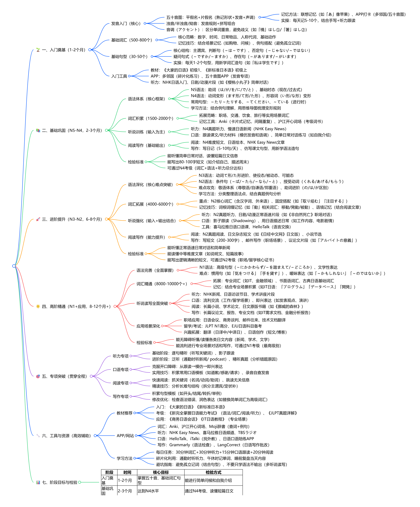
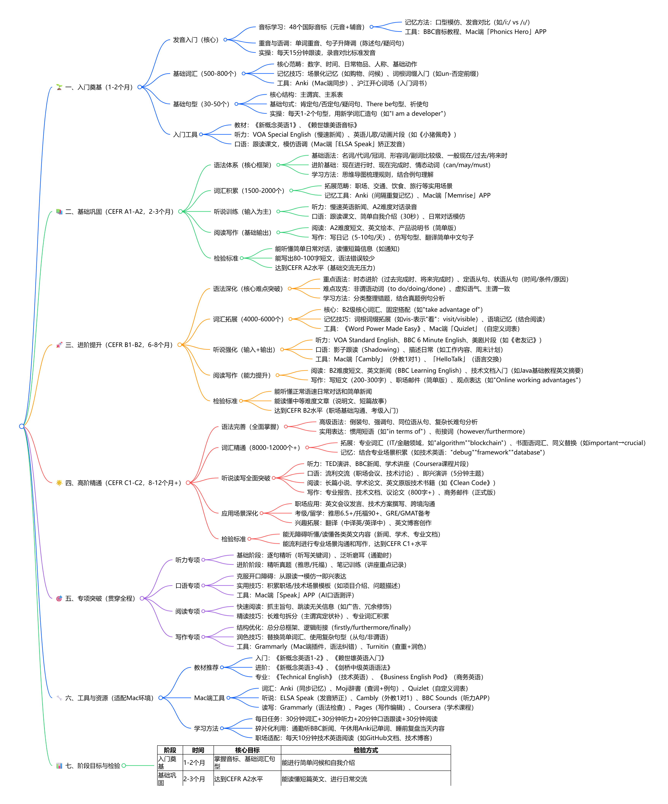
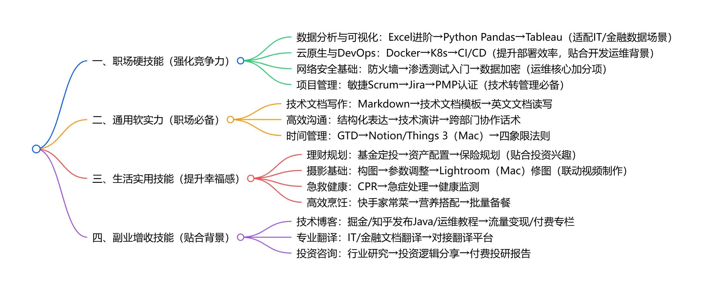

[TOC]
# 1️⃣Final Cut Pro 学习路线图
## 🌱 一、入门基础（1-2周）
- 系统环境
  - 配置要求：macOS 12+，16GB+内存（4K建议32GB）
  - 媒体策略：外置SSD存素材，开启代理文件
- 核心概念
  - 层级关系：资源库→事件→项目→片段
  - 核心特性：磁性时间线（自动吸附/填补）
- 界面导航
  - 五大核心区：浏览器→检视器→时间线→检查器→工具栏
- 必背快捷键
  - 工具类：V(选择)、B(刀片)、T(修剪)、Z(缩放)
  - 操作类：JKL(播放)、I/O(入/出点)、E(追加)、Q(连接)
  - 辅助类：Cmd+Z(撤销)、Cmd+S(保存)
## 📐 二、媒体管理（2周）
- 素材导入
  - 批量导入：文件夹拖拽/媒体浏览器
  - 优化处理：创建代理文件（低配置）、优化媒体（高质量）
- 智能分类
  - 关键词标记(Cmd+K)、评分(1-5星)
  - 智能收藏（条件筛选）
- 资源库维护
  - 定期备份：外置硬盘/云存储
  - 清理冗余：删除未使用媒体
  - 拆分过大资源库
## 🎬 三、核心剪辑（3周）
- 时间线操作
  - 片段添加：E(追加)、Q(连接)、W(插入)、D(覆盖)
  - 轨道管理：Option+Cmd+↑/↓添加，隐藏轨道（眼睛图标）
- 修剪技巧
  - 波纹修剪：拖动片段边缘
  - 滚动修剪：Option+拖动分界
  - 精确修剪：T工具+方向键（逐帧）
- 高级编辑
  - 多机位：同步素材→创建项目→切换角度
  - 速度控制：更改速度、添加速度点、冻结帧
## 🔊 四、音频处理（2周）
- 基础操作
  - 分离/链接：Control+Shift+S（分离）、Control+L（链接）
  - 音量调整：拖动波形/检查器精确控制(dB)
- 专业音频
  - 效果：EQ、降噪、压缩（优化对话）
  - 混音：立体声/5.1环绕声
  - 音频增强：自动优化对话清晰度
## 📝 五、字幕与标题（2周）
- 字幕制作
  - 自动字幕：编辑→自动字幕（音频识别）
  - 手动添加：标题浏览器→拖入→编辑文本
- 标题设计
  - 内置模板：开场/片尾/字幕条
  - 自定义：Motion创建动态标题
  - 动画：淡入淡出、滑动、缩放
## 🎨 六、调色进阶（3周）
- 色彩校正
  - 流程：白平衡→曝光→对比度→饱和度→曲线
  - 工具：色轮（高光/中间调/阴影）、LUTs（预设色调）、遮罩调色（局部）
- HDR工作流
  - 项目设置启用HDR，调整峰值亮度
  - 输出：同时生成HDR和SDR版本
## 🚀 七、效率提升（贯穿全程）
- 自定义工作流
  - 快捷键设置：Cmd+M打开编辑器
  - 工作区定制：保存专注布局（剪辑/调色）
- 批量操作
  - 多片段统一调色/加特效
  - 预设保存：常用效果组合一键应用
- 性能优化
  - 低配置：启用代理文件
  - 清理：关闭后台应用、定期清缓存
## 📤 八、输出与项目管理（2周）
- 导出设置
  - 平台预设：YouTube(1080p/60fps)、抖音(9:16/30fps)
  - 高级：章节标记、嵌入字幕、多版本批量导出
- 项目备份
  - 资源库复制：外置硬盘备份
  - XML导出：保存项目结构（协作/应急）
- 故障处理
  - 媒体离线：文件→重新链接媒体
  - 崩溃恢复：Option+Cmd+P+R重置偏好
## 📊 九、阶段目标
- 入门（2周）：1分钟视频（导入→剪辑→导出）
- 基础（3周）：3分钟Vlog（转场/字幕/简单调色）
- 进阶（4周）：访谈视频（多机位/音频/字幕）
- 精通（6+周）：商业级短片（调色/特效/专业音频）

# 2️⃣日语学习路线图（N5-N1）
## 🌱 一、入门奠基（1-2个月）
- 发音入门（核心）
  - 五十音图：平假名+片假名（熟记形状+发音+声调）
    - 记忆方法：联想记忆（如「あ」像苹果）、APP打卡（多邻国/五十音图）
    - 实操：每天记5-10个，结合手写+听力跟读
  - 浊音/半浊音/拗音：发音规则+拼写组合
  - 音调（アクセント）：区分单词重音，避免歧义（如「橋」はし①/「箸」はし②）
- 基础词汇（500-800个）
  - 核心范畴：数字、时间、日常物品、人称代词、基础动作
  - 记忆技巧：结合场景记忆（如购物、问候）、例句搭配（避免孤立记词）
- 基础句型（30-50个）
  - 核心结构：主谓宾、判断句（～は～です）、否定句（～じゃない/～ではない）
  - 疑问句式（～ですか/～ますか）、存在句（～があります/～がいます）
  - 实操：每天1-2个句型，用新学词汇造句（如「私は学生です」）
- 入门工具
  - 教材：《大家的日语》初级1、《新标准日本语》初级上
  - APP：多邻国（碎片化练习）、五十音图APP（发音专项）
  - 听力：NHK日语入门、日剧/动漫片段（如《樱桃小丸子》简单对话）

## 📚 二、基础巩固（N5-N4，2-3个月）
- 语法体系（核心框架）
  - N5语法：助词（は/が/を/に/で/と）、基础时态（现在/过去式）
  - N4语法：动词变形（ます形/て形/た形）、形容词（い形/な形）变形
  - 常用句型：～たり～たりする、～てください、～ている（进行时）
  - 学习方法：结合例句理解，用思维导图梳理变形规则
- 词汇积累（1500-2000个）
  - 拓展范畴：职场、交通、饮食、旅行等实用场景词汇
  - 记忆工具：Anki（卡片式记忆，间隔重复）、沪江开心词场（考级词书）
- 听说训练（输入为主）
  - 听力：N4真题听力、慢速日语新闻（NHK Easy News）
  - 口语：跟读课文/听力材料（模仿发音和语调）、简单日常对话练习（如自我介绍）
- 阅读写作（基础输出）
  - 阅读：N4难度短文、日语绘本、NHK Easy News文章
  - 写作：写日记（5-10句/天）、仿写课文句型、用新学语法造句
- 检验标准
  - 能听懂简单日常对话，读懂短篇日文信息
  - 能写出80-100字短文（如介绍自己、描述周末）
  - 可通过N4考级（词汇+语法+听力总分达标）

## 🚀 三、进阶提升（N3-N2，6-8个月）
- 语法深化（核心难点突破）
  - N3语法：动词て形/た形进阶、使役态/被动态、可能态
  - N2语法：条件句（～ば/～たら/～なら/～と）、授受动词（くれる/あげる/もらう）
  - 难点攻克：敬语体系（尊敬语/自谦语/郑重语）、助词进阶（の/は/が区别）
  - 学习方法：分类整理语法点，结合真题例句分析
- 词汇拓展（4000-6000个）
  - 重点：N2核心词汇（含汉字词、外来语）、固定搭配（如「取り組む」「注目する」）
  - 记忆技巧：词根词缀记忆（如「動」相关词汇：移動/発動/被動）、语境记忆（结合阅读文章）
- 听说强化（输入+输出结合）
  - 听力：N2真题听力、日剧/动漫正常语速片段（如《非自然死亡》职场对话）
  - 口语：影子跟读（Shadowing）、用日语描述日常（如工作内容、电影剧情）
  - 工具：喜马拉雅日语口语课、HelloTalk（语言交换）
- 阅读写作（能力提升）
  - 阅读：N2真题阅读、日文杂志短文（如《日经中文网》日文版）、小说节选
  - 写作：写短文（200-300字）、邮件写作（职场场景）、议论文片段（如「アルバイトの意義」）
- 检验标准
  - 能听懂正常语速日常对话和简单新闻
  - 能读懂中等难度文章（如说明文、短篇故事）
  - 能写出逻辑清晰的短文，可通过N2考级（职场/留学核心证书）

## 🌟 四、高阶精通（N1+应用，8-12个月+）
- 语法完善（全面掌握）
  - N1语法：高级句型（～にかかわらず/～を踏まえて/～どころか）、文学性表达
  - 难点：惯用句（如「気をつける」「手を貸す」）、暧昧表达（如「～かもしれない」「～のではないか」）
- 词汇精通（8000-10000个+）
  - 拓展：专业词汇（如IT、金融领域）、书面语词汇、古典日语基础词汇
  - 记忆：结合专业场景积累（如IT日语：「プログラム」「データベース」「開発」）
- 听说读写全面突破
  - 听力：NHK新闻、日语访谈节目、学术讲座片段
  - 口语：流利交流（工作/留学场景）、即兴表达（如发表观点、演讲）
  - 阅读：长篇小说、学术论文、日文原版书籍（如《挪威的森林》）
  - 写作：长篇议论文、报告、专业文档（如IT需求文档、金融分析报告）
- 应用场景深化
  - 职场应用：日语会议、商务谈判、邮件往来、技术文档翻译
  - 留学/考试：JLPT N1高分、EJU日语科目备考
  - 兴趣拓展：翻译（日译中/中译日）、日语创作（短文/博客）
- 检验标准
  - 能无障碍听懂/读懂各类日文内容（新闻、学术、文学）
  - 能流利进行专业场景对话和写作，可通过N1考级（最高级别）

## 🎯 五、专项突破（贯穿全程）
- 听力专项
  - 基础阶段：逐句精听（听写关键词）、影子跟读
  - 进阶阶段：泛听（通勤时听新闻/ podcast）、精听真题（分析错题原因）
- 口语专项
  - 克服开口障碍：从跟读→模仿→即兴表达
  - 实用技巧：积累常用口语模板（如道歉/感谢/请求）、录音自查发音
- 阅读专项
  - 快速阅读：抓关键词（名词/动词/助词）、跳读无关信息
  - 精读技巧：分析长难句结构（拆分主谓宾/定状补）
- 写作专项
  - 积累句型模板（如开头/结尾/转折/举例）
  - 修改优化：检查语法错误、润色表达（如替换简单词汇为高级词汇）

## 🔧 六、工具与资源（高效辅助）
- 教材推荐
  - 入门：《大家的日语》《新标准日本语》
  - 考级：《新完全掌握日语能力考试》（语法/词汇/阅读/听力）、《JLPT真题详解》
  - 应用：《商务日语会话》《IT日语教程》（专业场景）
- APP/网站
  - 词汇：Anki、沪江开心词场、Moji辞書（查词+例句）
  - 听力：NHK Easy News、喜马拉雅日语频道、TBSラジオ
  - 口语：HelloTalk、iTalki（找外教）、日语口语陪练APP
  - 写作：Grammarly（语法检查）、LangCorrect（日语写作批改）
- 学习方法
  - 每日任务：30分钟词汇+30分钟听力+15分钟口语跟读+20分钟阅读
  - 碎片化利用：通勤时听听力、午休时记单词、睡前复盘当天内容
  - 避坑指南：避免孤立记词（结合句型）、不要只学语法不输出（多听说读写）

## 📊 七、阶段目标与检验
| 阶段 | 时间 | 核心目标 | 检验方式 |
|------|------|----------|----------|
| 入门奠基 | 1-2个月 | 掌握五十音、基础词汇句型 | 能进行简单问候和自我介绍 |
| 基础巩固 | 2-3个月 | 达到N4水平 | 通过N4考级、读懂短篇日文 |
| 进阶提升 | 6-8个月 | 达到N2水平 | 通过N2考级、职场简单交流 |
| 高阶精通 | 8-12个月+ | 达到N1水平+专业应用 | 通过N1考级、流利职场/学术交流 |

# 3️⃣英语学习路线
## 🌱 一、入门奠基（1-2个月）
- 发音入门（核心）
  - 音标学习：48个国际音标（元音+辅音）
    - 记忆方法：口型模仿、发音对比（如/i:/ vs /ɪ/）
    - 工具：BBC音标教程、Mac端「Phonics Hero」APP
  - 重音与语调：单词重音、句子升降调（陈述句/疑问句）
  - 实操：每天15分钟跟读，录音对比标准发音
- 基础词汇（500-800个）
  - 核心范畴：数字、时间、日常物品、人称、基础动作
  - 记忆技巧：场景化记忆（如购物、问候）、词根词缀入门（如un-否定前缀）
  - 工具：Anki（Mac端同步）、沪江开心词场（入门词书）
- 基础句型（30-50个）
  - 核心结构：主谓宾、主系表
  - 基础句式：肯定句/否定句/疑问句、There be句型、祈使句
  - 实操：每天1-2个句型，用新学词汇造句（如"I am a developer"）
- 入门工具
  - 教材：《新概念英语1》、《赖世雄美语音标》
  - 听力：VOA Special English（慢速新闻）、英语儿歌/动画片段（如《小猪佩奇》）
  - 口语：跟读课文，模仿语调（Mac端「ELSA Speak」矫正发音）

## 📚 二、基础巩固（CEFR A1-A2，2-3个月）
- 语法体系（核心框架）
  - 基础语法：名词/代词/冠词、形容词/副词比较级、一般现在/过去/将来时
  - 进阶基础：现在进行时、现在完成时、情态动词（can/may/must）
  - 学习方法：思维导图梳理规则，结合例句理解
- 词汇积累（1500-2000个）
  - 拓展范畴：职场、交通、饮食、旅行等实用场景
  - 记忆工具：Anki（间隔重复记忆）、Mac端「Memrise」APP
- 听说训练（输入为主）
  - 听力：慢速英语新闻、A2难度对话录音
  - 口语：跟读课文、简单自我介绍（30秒）、日常对话模仿
- 阅读写作（基础输出）
  - 阅读：A2难度短文、英文绘本、产品说明书（简单版）
  - 写作：写日记（5-10句/天）、仿写句型、翻译简单中文句子
- 检验标准
  - 能听懂简单日常对话，读懂短篇信息（如通知）
  - 能写出80-100字短文，语法错误较少
  - 达到CEFR A2水平（基础交流无压力）

## 🚀 三、进阶提升（CEFR B1-B2，6-8个月）
- 语法深化（核心难点突破）
  - 重点语法：时态进阶（过去完成时、将来完成时）、定语从句、状语从句（时间/条件/原因）
  - 难点攻克：非谓语动词（to do/doing/done）、虚拟语气、主谓一致
  - 学习方法：分类整理错题，结合真题例句分析
- 词汇拓展（4000-6000个）
  - 核心：B2级核心词汇、固定搭配（如"take advantage of"）
  - 记忆技巧：词根词缀拓展（如vis-表示"看"：visit/visible）、语境记忆（结合阅读）
  - 工具：《Word Power Made Easy》、Mac端「Quizlet」（自定义词表）
- 听说强化（输入+输出）
  - 听力：VOA Standard English、BBC 6 Minute English、美剧片段（如《老友记》）
  - 口语：影子跟读（Shadowing）、描述日常（如工作内容、周末计划）
  - 工具：Mac端「Cambly」（外教1对1）、「HelloTalk」（语言交换）
- 阅读写作（能力提升）
  - 阅读：B2难度短文、英文新闻（BBC Learning English）、技术文档入门（如Java基础教程英文摘要）
  - 写作：写短文（200-300字）、职场邮件（简单版）、观点表达（如"Online working advantages"）
- 检验标准
  - 能听懂正常语速日常对话和简单新闻
  - 能读懂中等难度文章（说明文、短篇故事）
  - 达到CEFR B2水平（职场基础沟通、考级入门）

## 🌟 四、高阶精通（CEFR C1-C2，8-12个月+）
- 语法完善（全面掌握）
  - 高级语法：倒装句、强调句、同位语从句、复杂长难句分析
  - 实用表达：惯用短语（如"in terms of"）、衔接词（however/furthermore）
- 词汇精通（8000-12000个+）
  - 拓展：专业词汇（IT/金融领域，如"algorithm""blockchain"）、书面语词汇、同义替换（如important→crucial）
  - 记忆：结合专业场景积累（如技术英语："debug""framework""database"）
- 听说读写全面突破
  - 听力：TED演讲、BBC新闻、学术讲座（Coursera课程片段）
  - 口语：流利交流（职场会议、技术讨论）、即兴演讲（5分钟主题）
  - 阅读：长篇小说、学术论文、英文原版技术书籍（如《Clean Code》）
  - 写作：专业报告、技术文档、议论文（800字+）、商务邮件（正式版）
- 应用场景深化
  - 职场应用：英文会议发言、技术方案撰写、跨境沟通
  - 考级/留学：雅思6.5+/托福90+、GRE/GMAT备考
  - 兴趣拓展：翻译（中译英/英译中）、英文博客创作
- 检验标准
  - 能无障碍听懂/读懂各类英文内容（新闻、学术、专业文档）
  - 能流利进行专业场景沟通和写作，达到CEFR C1+水平

## 🎯 五、专项突破（贯穿全程）
- 听力专项
  - 基础阶段：逐句精听（听写关键词）、泛听磨耳（通勤时）
  - 进阶阶段：精听真题（雅思/托福）、笔记训练（讲座重点记录）
- 口语专项
  - 克服开口障碍：从跟读→模仿→即兴表达
  - 实用技巧：积累职场/技术场景模板（如项目介绍、问题描述）
  - 工具：Mac端「Speak」APP（AI口语测评）
- 阅读专项
  - 快速阅读：抓主旨句、跳读无关信息（如广告、冗余修饰）
  - 精读技巧：长难句拆分（主谓宾定状补）、专业词汇积累
- 写作专项
  - 结构优化：总分总框架、逻辑衔接（firstly/furthermore/finally）
  - 润色技巧：替换简单词汇、使用复杂句型（从句/非谓语）
  - 工具：Grammarly（Mac端插件，语法纠错）、Turnitin（查重+润色）

## 🔧 六、工具与资源（适配Mac环境）
- 教材推荐
  - 入门：《新概念英语1-2》、《赖世雄英语入门》
  - 进阶：《新概念英语3-4》、《剑桥中级英语语法》
  - 专业：《Technical English》（技术英语）、《Business English Pod》（商务英语）
- Mac端工具
  - 词汇：Anki（同步记忆）、Moji辞書（查词+例句）、Quizlet（自定义词表）
  - 听说：ELSA Speak（发音矫正）、Cambly（外教1对1）、BBC Sounds（听力APP）
  - 读写：Grammarly（语法检查）、Pages（写作编辑）、Coursera（学术课程）
- 学习方法
  - 每日任务：30分钟词汇+30分钟听力+20分钟口语跟读+30分钟阅读
  - 碎片化利用：通勤听BBC新闻、午休用Anki记单词、睡前复盘当天内容
  - 职场适配：每天10分钟技术英语阅读（如GitHub文档、技术博客）

## 📊 七、阶段目标与检验
| 阶段 | 时间 | 核心目标 | 检验方式 |
|------|------|----------|----------|
| 入门奠基 | 1-2个月 | 掌握音标、基础词汇句型 | 能进行简单问候和自我介绍 |
| 基础巩固 | 2-3个月 | 达到CEFR A2水平 | 能读懂短篇英文、进行日常交流 |
| 进阶提升 | 6-8个月 | 达到CEFR B2水平 | 能应对职场基础沟通、通过大学英语四级 |
| 高阶精通 | 8-12个月+ | 达到CEFR C1+水平 | 能读懂专业文档、流利商务/技术沟通、通过雅思6.5+/托福90+ |

### 一、职场硬技能（强化竞争力）
- 数据分析与可视化：Excel进阶→Python Pandas→Tableau（适配IT/金融数据场景）
- 云原生与DevOps：Docker→K8s→CI/CD（提升部署效率，贴合开发运维背景）
- 网络安全基础：防火墙→渗透测试入门→数据加密（运维核心加分项）
- 项目管理：敏捷Scrum→Jira→PMP认证（技术转管理必备）
### 二、通用软实力（职场必备）
- 技术文档写作：Markdown→技术文档模板→英文文档读写
- 高效沟通：结构化表达→技术演讲→跨部门协作话术
- 时间管理：GTD→Notion/Things 3（Mac）→四象限法则
### 三、生活实用技能（提升幸福感）
- 理财规划：基金定投→资产配置→保险规划（贴合投资兴趣）
- 摄影基础：构图→参数调整→Lightroom（Mac）修图（联动视频制作）
- 急救健康：CPR→急症处理→健康监测
- 高效烹饪：快手家常菜→营养搭配→批量备餐
### 四、副业增收技能（贴合背景）
- 技术博客：掘金/知乎发布Java/运维教程→流量变现/付费专栏
- 专业翻译：IT/金融文档翻译→对接翻译平台
- 投资咨询：行业研究→投资逻辑分享→付费投研报告
